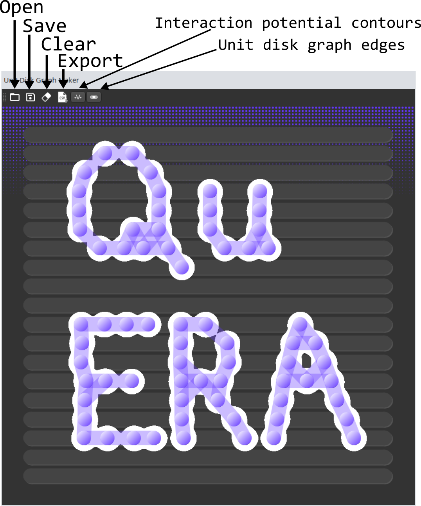

# Unit Disk Graph Maker
This is a GUI written in Python and PySide useful for creating unit disk graphs, specifically
intended for use with neutral atom platforms. This project is derivative of work done at 
MIT iQuHACK 2023 QuERA challenge, and was written with QuERA in mind. 

## Usage
* Left click the canvas to add an atom
* Left click and drag atoms to move
* Right click to delete

### Running
Navigate to `./unitdiskgraphmaker/`. Install dependencies and run `python unitdiskgraphmaker.py`.

## Features

### Rydgerg Potential Contours
The white blobs around the atoms are a real-time view of the $1/r^6$ Rydberg potential.
The area colored white represents the potential at the Rydberg blockade $~6.1\mu\text{m}$.
When the Blobs connect, this signifies that the excited states will be highly correlated, and
an edge appears on the unit disk graph.

### Exporting
The graph can be exported to a CSV file, which maps the canvas onto the $75 \mu \text{m} \times 76\mu \text{m}$
stage of the Aquila processor, scaling the coordinates of the nodes accordingly. The numbers
are rounded to the precision accepted by the QuERA API.

### Hardware Constraints
The hardware constraints are imposed so that graphs built with this software will be able ro
run with no errors. This includes 
* restricting the atoms to the $75 \mu\text{m} \times 76\mu\text{m}$ stage
of the Aquila processor, 
* Imposing the minimum discretized spacing on the $y$ axis of $4\mu\text{m}$
* Preventing atoms from being placed in closer proximity than the resolution of the control lasers, also $4\mu m$.

## Depenencies
* Python 3.10.9
* PySide2 5.15.8
* Numpy 1.22.4

## Acknowledgements
Thanks to Wyatt Kremer for giving me the inspiration for this GUI with his Desmos tool! Also thanks to my hackathon teammates Pranav Parakh, Alex Deters, and Sofia Fausone.
